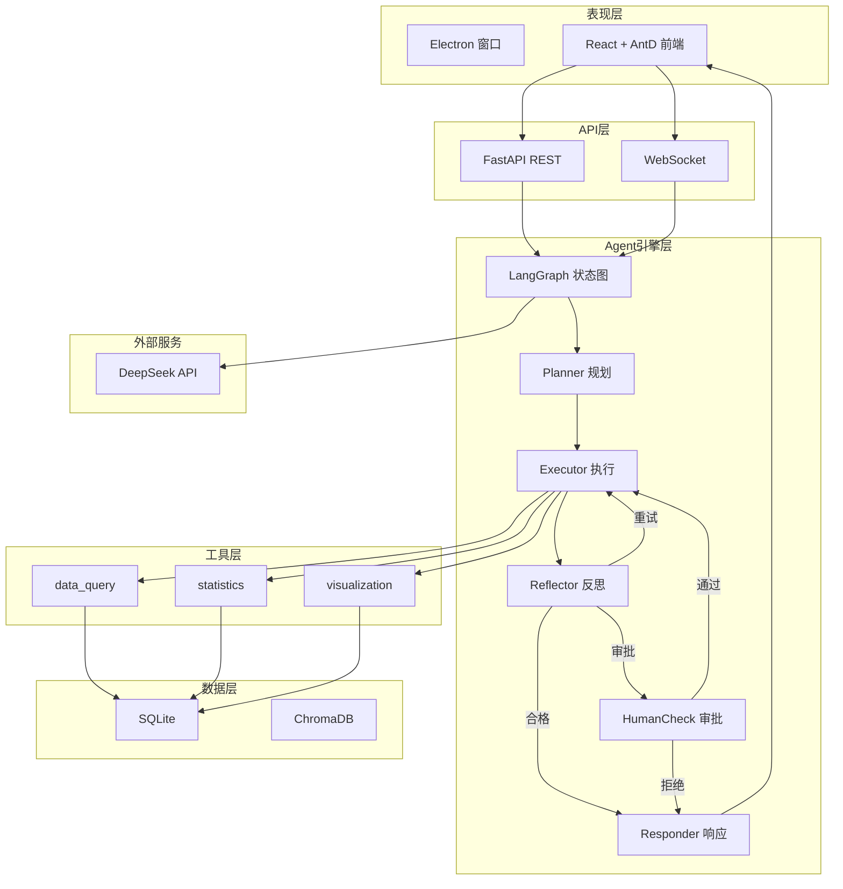

# 架构设计文档 (ARCHITECTURE)

## 系统分层架构



## 模块职责

| 模块 | 职责 | 核心文件 |
|------|------|----------|
| app.api | HTTP/WebSocket 端点 | chat.py, upload.py, analysis.py, data_source.py |
| app.agent | LangGraph 状态图引擎 | graph.py, state.py, nodes/ |
| app.agent.tools | 分析工具集 | data_query.py, statistics.py, visualization.py, schema.py |
| app.core | 基础设施 | config.py, database.py, llm.py |
| app.llm_providers | LLM 适配层 | deepseek.py, registry.py |
| app.models | ORM 模型 | data_source.py, analysis_record.py |
| app.services | 业务逻辑 | data_ingestion.py |

## Agent 数据流

```
用户提问 → Planner(LLM拆解) → Executor(调用工具) → Reflector(校验)
                                                        ├── 合格 → Responder(生成回答) → 用户
                                                        ├── 重试 → Executor
                                                        └── 需审批 → HumanCheck → Executor/Responder
```

## 关键设计决策

1. **工具参数 Schema** 使用 Pydantic BaseModel 定义，LLM 通过 Function Calling 感知
2. **列名模糊匹配** (_find_column) 解决用户提问列名与数据列名不一致的问题
3. **interrupt_before** 机制实现 LangGraph 原生暂停等待人工审批
4. **双通道输出** WebSocket 流式推送中间状态 + REST 同步返回完整结果
