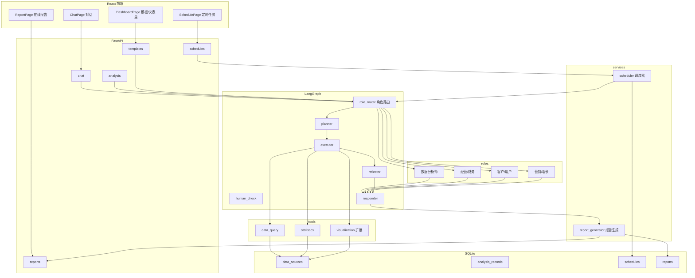

# 任务拆分文档 (TASK_BREAKDOWN)

## 一、进阶开发目标

在现有电商经营数据分析智能体上完成三个方向的进阶升级：

1. 视觉升级：融合高级感与复古风，以灰色或深蓝为主色调，替换当前做了一半的荧光绿终端风
2. 启动方式扩展：对话之外增加「一键分析模板」和「定时自动报告」
3. 分析成果专业化：接入四个专业分析师角色，产出在线交互报告并支持导出 PDF

## 二、新增系统架构

## 三、模块接口契约

| 模块 | 输入 | 输出 |
|------|------|------|
| role_router | 用户问题、用户指定角色、数据源摘要 | 归一化角色键 role_key |
| roles | role_key、分析上下文 | 该角色的系统提示词、报告结构定义、图表偏好 |
| templates | 模板 id、数据源 id | 展开后的分析问题 question |
| scheduler | schedule 配置、数据源 id | 触发一次完整分析并落库为 report |
| report_generator | plan/tool_results/final_response/charts/tables + role_key | 结构化 report（title/summary/sections/insights/charts/tables） |

## 四、角色定义

| role_key | 名称 | 分析角度 | 侧重图表 |
|----------|------|----------|----------|
| data_analyst | 数据分析师 | 统计指标、趋势、异常、归因 | 折线、柱状、饼图、散点 |
| finance_analyst | 经营/财务分析师 | 利润、成本、毛利、ROI、库存周转 | 指标卡、柱状、瀑布图 |
| customer_analyst | 客户/用户分析师 | 客户画像、RFM 分层、复购、流失 | 饼图、雷达图、漏斗图 |
| marketing_analyst | 营销/增长分析师 | 渠道效果、转化漏斗、拉新留存 | 漏斗图、柱状、折线 |

## 五、原子任务清单

### 阶段一：视觉主题重做（灰/深蓝高级复古风）

T1.1 定义设计令牌：在 global.css 建立 CSS 变量（背景 #0b0f14、表面 #121820、边框 #243040、正文 #d5dbe3、次文 #8b96a3、主色 #3b82f6、强调 #60a5fa、复古辉光），替换现有荧光绿变量。输入：现有 global.css；输出：统一色板令牌。

T1.2 重做布局组件：Header、Sidebar、Logo、App 背景与 CRT overlay，把荧光绿（#00ff41/#1f3a1f）整体替换为灰蓝。输入：上述 4 文件；输出：统一灰蓝主题的布局层。

T1.3 重做对话组件：MessageBubble、ChartCard、TableCard、ChatContainer 输入区与空状态，统一为灰蓝玻璃拟态 + 等宽字体数字点缀。输入：上述组件；输出：对话与图表区视觉统一。

### 阶段二：多角色分析引擎

T2.1 角色定义层：新增 roles.py，定义 4 个角色的系统提示词、报告结构、图表偏好，提供 get_role(role_key) 与 infer_role(question)。输入：无；输出：角色定义模块。

T2.2 角色路由与状态：AgentState 增加 role_key 字段，planner 与 responder 读取角色注入对应提示词。输入：state.py、responder.py、graph.py；输出：角色贯穿规划与响应。

T2.3 前端角色选择器：ChatContainer 增加角色下拉（自动/四角色），发送时携带 role 字段，chat.py 透传。输入：ChatContainer.tsx、useChat.ts、chat.py；输出：用户可切换分析角色。

### 阶段三：一键分析模板

T3.1 模板定义：新增 templates.py 定义 8~10 个预设场景（销售趋势、品类占比、客户画像、RFM 分层、经营健康度、利润毛利、渠道转化、复购流失）。输入：无；输出：模板清单模块。

T3.2 模板 API：新增 api/templates.py 提供 GET /api/templates，返回模板清单。输入：无；输出：模板查询端点。

T3.3 前端模板选择：ChatContainer 或新 DashboardPage 展示模板卡片，点击填充问题并选中数据源后发起分析。输入：前端页面；输出：一键发起分析交互。

### 阶段四：定时自动报告

T4.1 调度模型：新增 models/report.py 定义 ReportSchedule 与 Report 两个 ORM，init_db 建表。输入：database.py；输出：调度与报告数据表。

T4.2 调度器与报告生成：新增 services/scheduler.py 基于 APScheduler 或 asyncio 循环，到期触发 run_agent 并调用 report_generator 落库。输入：schedule 记录；输出：report 记录。

T4.3 调度 API：新增 api/schedules.py 提供 schedule 的增删改查与立即运行、reports 列表查询。输入：HTTP 请求；输出：调度与报告数据。

T4.4 前端定时管理：新增 SchedulePage 展示调度列表、新建/编辑/删除、查看已生成报告。输入：页面；输出：定时任务管理界面。

### 阶段五：专业报告（在线 + PDF）

T5.1 报告生成服务：新增 services/report_generator.py 将分析结果按角色结构化为 report（title/summary/sections/insights/charts/tables）。输入：分析结果 + role_key；输出：结构化 report。

T5.2 报告 API：新增 api/reports.py 提供 GET /api/reports 与 GET /api/reports/{id}。输入：report id；输出：report JSON。

T5.3 在线报告页：新增 ReportPage 渲染结构化报告，图表用 ECharts 交互展示，支持导出 PDF。输入：report JSON；输出：在线报告界面。

T5.4 PDF 导出增强：改造 generateReport.ts，把 ECharts 图表渲染为图片嵌入 PDF，替换占位符。输入：report + 图表 option；输出：排版专业的 PDF。

### 阶段六：图表扩展

T6.1 图表类型扩展：visualization.py 新增 funnel、radar、heatmap 构建函数，接入可视化工具。输入：数据 + 图表类型；输出：新增 ECharts option。

T6.2 图表角色适配：role 相关报告结构引导 responder/planner 选择对应图表类型。输入：role_key；输出：角色适配的图表选择。

### 阶段七：总体验证

T7.1 后端验证：启动服务，health 检查通过，新增 API 冒烟测试，pytest 全量通过。

T7.2 前端验证：tsc 0 错误，build 通过，核心页面手工走查。

## 六、验收标准

- 前端无残留荧光绿，主色调为灰/深蓝，等宽字体数字与辉光营造复古科技感
- 对话页可切换 4 个角色，回答角度随角色变化
- 模板卡片一键发起分析，定时任务到点自动生成报告
- 报告页在线可交互查看，一键导出排版专业的 PDF
- 后端 pytest 通过，前端 tsc 与 build 0 错误
