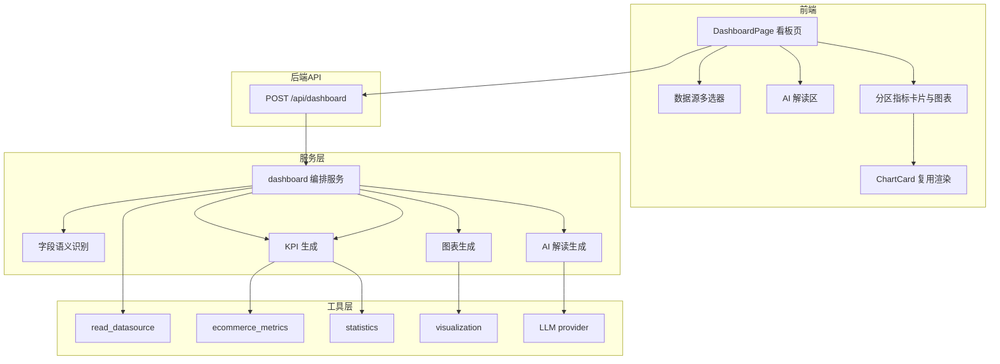

# 阶段七 spec：数据看板

## 目标

新增独立的数据看板页面。用户同时选择多个数据源后，系统智能识别每个数据源的字段语义，动态生成适配的经营指标卡片与可视化图表，按数据源分区并列展示，顶部提供一段 AI 经营解读。

## 需求决策（已与用户确认）

1. 智能识别生成：系统扫描字段，识别销售、订单、客户、品类、日期、地域等语义，动态生成 KPI 卡片与图表，缺字段的指标自动跳过。
2. 需要 AI 解读：看板顶部生成一段经营解读，依赖 DeepSeek API Key；无 Key 或调用失败时降级为规则文案。
3. 多数据源：支持同时选中多份数据表。
4. 分区并列展示：每个数据源各自生成指标与图表，看板上分区并列，互不干扰。

## 现状与可复用能力

后端已有以下可直接复用的模块：

- `app/services/data_ingestion.py` 的 `read_datasource(data_source_id)` 读取数据源为 DataFrame。
- `app/services/data_ingestion.py` 的 `infer_purpose(name, columns_meta)` 推断数据源用途（订单/客户/库存/商品/通用）。
- `app/agent/tools/ecommerce_metrics.py` 提供客单价、复购率、退货率、毛利率、RFM 等指标计算，函数内部已含列名自动检测，缺列返回 `success=False`。
- `app/agent/tools/statistics.py` 提供聚合统计。
- `app/agent/tools/visualization.py` 提供 line/bar/pie 等 ECharts option 生成，含分类列与数值列智能推断。
- `app/agent/tools/ecommerce_metrics.py` 中的候选列名词库常量可复用。

前端已有：

- `components/Chat/ChartCard.tsx` 可渲染任意 ECharts option。
- `api/types.ts` 已有 `DataSourceInfo` 类型。
- `api/client.ts` axios 实例。
- `App.tsx` 路由与 `Sidebar.tsx` 导航。

## 架构设计



## 模块接口契约

### 后端新增

`app/api/dashboard.py` 路由：

- `POST /api/dashboard`，请求体 `{"data_source_ids": ["uuid1", "uuid2"]}`。
- 响应结构：

```json
{
  "insight": {
    "text": "经营解读文字",
    "source": "ai"
  },
  "sections": [
    {
      "data_source_id": "uuid1",
      "name": "订单数据.csv",
      "purpose": "订单/销售数据",
      "row_count": 1234,
      "kpis": [
        { "key": "sales", "label": "销售额", "value": 123456.78, "unit": "元", "kind": "currency" }
      ],
      "charts": [
        { "chart_type": "line", "title": "销售趋势", "echarts_option": {} }
      ]
    }
  ]
}
```

`app/services/dashboard.py` 服务层函数：

- `detect_field_roles(df) -> dict`：识别字段角色（日期、金额、订单、客户、品类、状态、数量、成本、地理）。
- `build_section(data_source_id) -> dict`：生成单个数据源的分区（KPI 卡片 + 图表）。
- `build_dashboard(data_source_ids) -> dict`：遍历数据源生成完整看板结构。
- `generate_insight(sections) -> dict`：生成 AI 解读，失败降级为规则文案。

### 前端新增

- `pages/DashboardPage.tsx`：看板页面，含数据源多选、AI 解读区、分区展示。
- `App.tsx` 新增路由 `/dashboard`，`Sidebar.tsx` 新增「数据看板」导航项。
- `api/types.ts` 新增 `DashboardInsight`、`DashboardKpi`、`DashboardChartBlock`、`DashboardSection`、`DashboardResponse` 类型。

## 字段智能识别规则

在 dashboard 服务内复用 `ecommerce_metrics` 的候选列名词库，识别以下字段角色：

- 日期列：用于销售趋势图，取 `_DATE_CANDIDATES`。
- 金额列：用于销售额、客单价、毛利率，取 `_AMOUNT_CANDIDATES`。
- 订单列：用于订单量，取 `_ORDER_ID_CANDIDATES`。
- 客户列：用于客户数、复购率、RFM，取 `_CUSTOMER_ID_CANDIDATES`。
- 品类列：用于品类占比，取商品/品类相关关键词。
- 状态列：用于退货率，取 `_STATUS_CANDIDATES`。
- 成本列：用于毛利率，取 `_COST_CANDIDATES`。
- 数量列：用于销量，取 `_SALES_VOLUME_CANDIDATES`。
- 地理列：用于地域分布，复用 `visualization._GEO_KEYWORDS` 的语义。

## KPI 卡片生成规则

对每个数据源按字段可用性依次尝试计算，成功则加入卡片，失败跳过：

1. 销售额：金额列求和。
2. 订单量：订单列去重计数，缺订单列时退化为行数。
3. 客单价：金额求和除以订单去重数，复用 `ecommerce_metrics` aov。
4. 客户数：客户列去重计数。
5. 复购率：客户列，复用 `ecommerce_metrics` repeat_purchase_rate。
6. 退货率：状态列，复用 `ecommerce_metrics` return_rate。
7. 毛利率：金额列加成本列，复用 `ecommerce_metrics` profit_margin。
8. 销量：数量列求和。

## 图表生成规则

对每个数据源按字段可用性依次尝试生成，失败跳过：

1. 销售趋势：日期列加金额列，chart_type 为 line。
2. 品类占比：品类列加金额列或数量列，chart_type 为 pie。
3. 地域分布：地理列加金额列或数量列，chart_type 为 bar。
4. 商品销量 TOP-N：商品列加数量列，chart_type 为 bar。

图表统一复用 `visualization` 生成 ECharts option，保证智能推断与降级逻辑一致。

## AI 解读生成规则

1. 将所有分区内的 KPI 汇总为上下文文本，包含数据源数量、各核心指标数值。
2. 调用 `get_llm().chat()` 生成一段简短经营解读，覆盖整体经营表现、亮点与风险。
3. 无 API Key 或调用异常时，降级为规则文案，用模板拼接核心指标，`source` 标记为 `rule`。

## 原子化任务拆分

1. 后端字段角色识别函数 `detect_field_roles`。
2. 后端单数据源分区构建函数 `build_section`（含 KPI 与图表生成）。
3. 后端看板编排 `build_dashboard` 与 AI 解读 `generate_insight`。
4. 后端 `POST /api/dashboard` 路由并注册到 `main.py`。
5. 前端 `types.ts` 新增看板类型。
6. 前端 `DashboardPage.tsx` 页面（多选、解读区、分区渲染）。
7. 前端路由与侧边栏入口接入。
8. 联调验证：后端接口、前端 tsc 与 build。

## 验收标准

1. 看板页面可同时选择多个数据源并生成分区并列的看板。
2. 每个数据源根据字段自动生成可用 KPI 卡片与图表，缺字段的指标自动跳过，不报错。
3. 顶部展示 AI 经营解读；无 API Key 时展示规则文案且不中断。
4. 后端 `/api/dashboard` 返回结构符合契约。
5. 前端 `tsc --noEmit` 与 `vite build` 通过。
