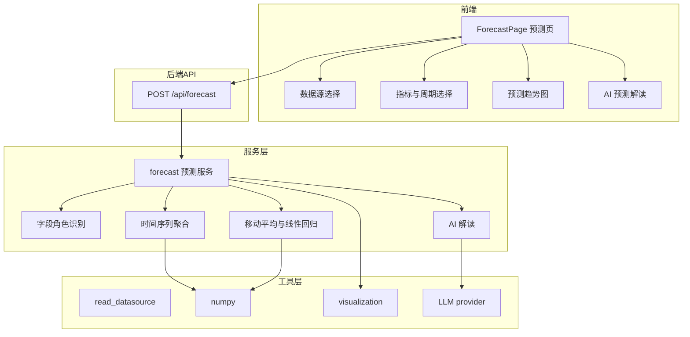

# 阶段八 spec：预测分析

## 目标

新增独立的预测分析页面。用户选择数据源、预测指标与预测周期后，基于历史数据用统计方法生成未来趋势预测图，顶部提供 AI 预测解读；无 API Key 时明确提示未接入 AI，不做规则文案降级。

## 需求决策（已与用户确认）

1. 预测目标：销量、销售额、订单量的未来趋势预测。
2. 交互入口：独立预测页，与数据看板风格一致。
3. 无 API Key 时提示未接入 AI，不生成规则文案兜底。

## 现状与可复用能力

后端已有：

- `read_datasource` 读取数据源为 DataFrame。
- `ecommerce_metrics` 中的候选列名词库（日期、金额、数量、订单列）。
- `visualization` 生成 line 图 ECharts option，可复用渲染趋势图。
- `get_llm().chat()` 调用 LLM，无 Key 时抛 `ValueError`。

前端已有：

- `ChartCard` 渲染 ECharts，且已做深色文字适配。
- `useDataSources` 获取数据源列表。
- `DashboardPage` 的深色卡片与页面骨架可参考。

## 架构设计



## 模块接口契约

### 后端新增

`app/services/forecast.py` 服务层：

- `detect_forecast_fields(df) -> dict`：识别日期列与数值指标列。
- `build_time_series(df, date_col, value_col, freq) -> dict`：按时间粒度聚合历史序列。
- `forecast_series(series, periods, method) -> dict`：用移动平均或线性回归外推未来值。
- `build_forecast(data_source_id, metric, periods, method) -> dict`：生成预测结果。
- `generate_forecast_insight(context) -> dict`：AI 解读，无 Key 返回未接入提示。

`app/api/forecast.py` 路由：

- `POST /api/forecast`，请求体 `{"data_source_id": "...", "metric": "sales|orders|qty", "periods": 30, "method": "linear|moving_avg"}`。
- 响应结构：

```json
{
  "metric": "sales",
  "metric_label": "销售额",
  "method": "linear",
  "periods": 30,
  "dates": ["2025-06-01", "..."],
  "actual": [123.0, "..."],
  "forecast": [null, "...", 456.0],
  "insight": { "text": "预测解读", "source": "ai" }
}
```

其中 `forecast` 与 `actual` 长度一致，历史区间为 null，预测区间为数值。

### 前端新增

- `pages/ForecastPage.tsx`：预测页，含数据源选择、指标选择、周期选择、预测趋势图、AI 解读。
- `api/types.ts` 新增 `ForecastResponse` 类型。
- `App.tsx` 新增路由 `/forecast`，`Sidebar.tsx` 与 `Header.tsx` 新增入口与标题。

## 预测算法

1. 移动平均：以最近 N 个观测均值作为下一期预测，逐步滚动外推，适合平稳序列。
2. 线性回归：用最小二乘拟合历史序列的线性趋势，外推未来各期，适合有明确增长或下降趋势的序列。

两者均用 numpy 实现，不引入 prophet 等重依赖。默认方法为线性回归。

## 指标映射

- `sales`：销售额，取金额列求和。
- `orders`：订单量，取订单列去重计数，缺订单列时取行数。
- `qty`：销量，取数量列求和。

## 无 Key 处理规则

AI 解读无 Key 或调用失败时，返回 `{"text": "未接入 AI，无法生成预测解读。", "source": "unavailable"}`，前端显示为提示而非规则文案。

## 原子化任务拆分

1. 后端预测字段识别与时间序列聚合。
2. 后端移动平均与线性回归预测算法。
3. 后端 `build_forecast` 编排与 AI 解读。
4. 后端 `POST /api/forecast` 路由并注册。
5. 前端 `types.ts` 新增预测类型。
6. 前端 `ForecastPage.tsx` 页面。
7. 前端路由、侧边栏、Header 接入。
8. 回改数据看板：无 Key 时提示未接入 AI，移除规则文案降级。
9. 联调验证。

## 验收标准

1. 预测页可选择数据源、指标与周期，生成历史实际值与未来预测值的趋势图。
2. 移动平均与线性回归两种方法均可生成合理预测。
3. 有 API Key 时展示 AI 预测解读，无 Key 时提示未接入 AI。
4. 数据看板无 Key 时同样提示未接入 AI，不再展示规则文案。
5. 后端 `/api/forecast` 返回结构符合契约。
6. 前端 `tsc --noEmit` 与 `vite build` 通过。
